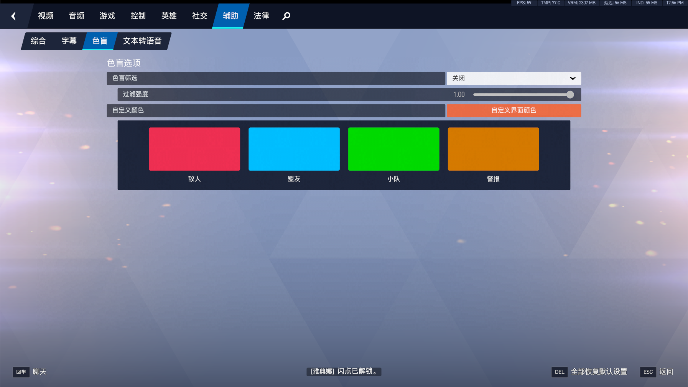
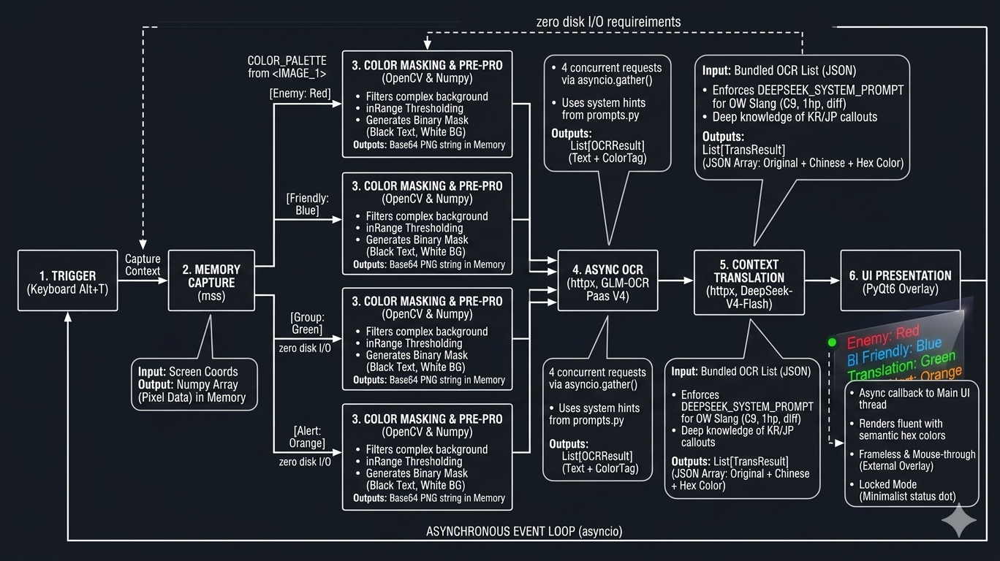

# OW-Light-Translator

> 軽量 · リアルタイム · アンチチート配慮 · オーバーウォッチ画面翻訳 Overlay

**Language / 语言 / 言語 / 언어：** [中文](README.md) | [English](README.en.md) | **日本語** | [한국어](README.ko.md)

---

## 日本語

### プロジェクト概要

**OW-Light-Translator** は『オーバーウォッチ』プレイヤー向けの**外部スクリーン翻訳ツール**です。アジアサーバーでよく見る韓国語・日本語・英語混在チャット——`힐좀`、`C9`、`support diff`、`源氏1hp`——を範囲指定してワンキーで認識し、**中国本土のゲーマーが慣れ親しんだ中文ゲーム用語**に翻訳、透明オーバーレイに表示します。操作を中断しません。

対象ユーザー：

- アジアサーバーで競技プレイ中、韓/日/英混在のやり取りを素早く理解したいプレイヤー
- 「外部 Overlay + 非同期 OCR/LLM」アーキテクチャを学びたい Python 開発者

### アンチチート・安全設計

本ツールはゲームメモリの**読み書きなし**、**DLL インジェクションなし**、**キー・マウス入力のシミュレーションなし**。Windows 標準のデスクトップキャプチャ（`mss` / Desktop Duplication）のみ使用し、外部ウィンドウに翻訳結果を表示します（OBS や Discord オーバーレイと同系統）。

> ⚠️ サードパーティツールの利用リスクは自己判断で。Blizzard Entertainment とは無関係であり、アンチチートによる検出がないことも保証しません——ご利用は慎重に。

### OCR 認識について

現在の OCR は**デフォルト設定**を前提としています。『オーバーウォッチ』チャットの 4 種類の意味色（敵 / 味方 / パーティ / システム）ごとにマスクを分けて認識します。色範囲は `config.py` の `COLOR_PALETTE` を参照してください。

<p align="center">
  
</p>

> 上図：ゲーム内チャット文字色と意味タグの対応。Enemy（赤）、Friendly（青）、Group（緑）、Alert（橙）。

### 主な機能

| 機能 | 内容 |
|------|------|
| デュアル UI | **編集モード**：ドラッグ・リサイズ可能；**ロックモード**：枠なし・透明・クリック透過・最前面 |
| ディスク I/O ゼロ | スクリーンショットをメモリ上で Base64 化、一時ファイルなし |
| マルチチャネル OCR | 色マスクでチャネル分離し、背景ノイズを低減 |
| 非同期パイプライン | UI / ホットキーをブロックしない；キャプチャ → OCR → 翻訳を `asyncio` ワーカーで実行 |
| OW スラング対応 | DeepSeek System Prompt 内蔵。C9、Diff、ヒーロー略称、韓日コールアウトをカバー |

### 処理フロー

<p align="center">
  
</p>

> 上図：全体データフロー — `mss` 領域キャプチャ（メモリ Base64）→ `COLOR_PALETTE` マルチチャネル色マスク → 智譜 GLM-OCR → DeepSeek 翻訳 → PyQt6 Overlay で意味色付き表示。

### プロジェクト構成

```
overwatch_translate_tool/
├── main.py            # PyQt6 メイン、ホットキー、async イベントループ
├── api_client.py      # GLM-OCR / DeepSeek 非同期 HTTP クライアント
├── config.py          # DTO と環境変数
├── prompts.py         # OW スラング翻訳 System Prompt
├── local_api_keys.py  # ローカル API Key（gitignore 対象）
├── img/
│   ├── image.png      # 詳細システムフロー図
│   └── font_color.png # チャット色意味の参考図
├── requirements.txt
├── README.md
├── README.en.md
├── README.ja.md
└── README.ko.md
```

### 開発者ガイド

本プロジェクトに参加する開発者向け：環境・技術スタック・協業フローをまとめています。

#### 環境要件

| 項目 | 要件 | 補足 |
|------|------|------|
| OS | **Windows 10/11** | 主ターゲット；`mss` キャプチャと `keyboard` ホットキーは Windows が最安定 |
| Python | **3.10+**（3.11 / 3.12 推奨） | `dataclass(slots=True)` 等のモダン構文を使用 |
| パッケージ | `pip` + `venv` | 仮想環境の利用を推奨 |
| VCS | **Git** | Fork → ブランチ → PR |
| IDE | **VS Code / Cursor** | Python + Pylance；Overlay デバッグはデュアルモニター推奨 |
| 任意 | 『OW』クライアント | 実画面 OCR 調整時のみ必要；API 層のみなら不要 |

#### 技術スタック

| レイヤ | ライブラリ / サービス | バージョン | 役割 |
|--------|----------------------|------------|------|
| UI | [PyQt6](https://www.riverbankcomputing.com/software/pyqt/) | `>=6.6.0` | フレームレス Overlay、ドラッグ、クリック透過、色付き描画 |
| キャプチャ | [mss](https://python-mss.readthedocs.io/) | `>=9.0.1` | 領域スクリーンショット（メモリのみ） |
| 画像 | [OpenCV](https://opencv.org/) | `>=4.10` | 色マスク、モルフォロジー、PNG メモリエンコード |
| 数値 | [NumPy](https://numpy.org/) | `>=1.26` | フレーム・マスク配列演算 |
| 画像 | [Pillow](https://python-pillow.org/) | `>=10.3` | 画像フォーマット補助 |
| ネットワーク | [httpx](https://www.python-httpx.org/) | `>=0.27` | GLM-OCR / DeepSeek 非同期 HTTP |
| 並行 | `asyncio`（標準） | — | UI と OCR/翻訳 worker の分離 |
| ホットキー | [keyboard](https://github.com/boppreh/keyboard) | `>=0.13.5` | グローバルショートカット |
| 設定 | [python-dotenv](https://github.com/theskumar/python-dotenv) | `>=1.0` | `.env` による URL・タイムアウト等 |
| OCR API | 智譜 **GLM-OCR** | — | マルチチャネル OCR |
| 翻訳 API | **DeepSeek Chat** | — | OW スラング → 中文 |

#### クイックスタート

```bash
git clone https://github.com/<your-org>/overwatch_translate_tool.git
cd overwatch_translate_tool

python -m venv .venv
.venv\Scripts\Activate.ps1

pip install -U pip
pip install -r requirements.txt

python main.py    # main.py 完成後
```

#### API Key 設定

ルートの `local_api_keys.py` を編集（gitignore 済み）：

```python
GLM_API_KEY = "智譜 GLM の Key"
DEEPSEEK_API_KEY = "DeepSeek の Key"
```

`.env` も利用可（優先：`local_api_keys.py` > 環境変数）。

#### モジュール分担

| ファイル | 責務 | 典型的な変更 |
|----------|------|--------------|
| `config.py` | DTO、`COLOR_PALETTE` | 色マスク範囲、タイムアウト |
| `prompts.py` | Prompt 構築 | スラング辞書、翻訳トーン |
| `api_client.py` | キャプチャ・OCR・翻訳 | 並行数、リトライ、パース |
| `main.py` | PyQt6 UI | Overlay 操作、描画 |
| `local_api_keys.py` | ローカル秘密情報 | コミット禁止 |

#### 開発フロー

Fork → `git checkout -b feat/xxx` → 実装・検証 → commit/push → Pull Request

**PR に含めること：** 変更理由、影響モジュール、テスト方法（API のみ / ゲーム連携）。

#### ローカルデバッグ

```python
import asyncio
from api_client import capture_region_to_base64, process_multi_channel_ocr, translate_ocr_results

async def smoke_test():
    capture = capture_region_to_base64({"left": 0, "top": 0, "width": 800, "height": 400})
    ocr = await process_multi_channel_ocr(capture)
    print(await translate_ocr_results(ocr))

asyncio.run(smoke_test())
```

| 症状 | 確認項目 |
|------|----------|
| OCR 空 | `GLM_API_KEY`、`COLOR_PALETTE`、キャプチャ範囲 |
| 翻訳空 | `DEEPSEEK_API_KEY`、ネットワーク、`prompts.py` |
| ホットキー無効 | 管理者実行、ショートカット競合 |
| import 失敗 | venv 有効化、`pip install -r requirements.txt` |

### 開発状況

| モジュール | 状態 |
|-----------|------|
| `config.py` | ✅ 完了 |
| `prompts.py` | ✅ 完了（更新可） |
| `api_client.py` | ✅ 完了 |
| `main.py` | 🚧 開発中 |

### 貢献・ライセンス

Issue / PR 歓迎。特に韓国語・日本語に堪能なプレイヤーから、より正確なローカライズ翻訳例の提供や PR をお待ちしています。Blizzard 利用規約を遵守し、チートや自動操作用途での使用は禁止してください。
---

## License

MIT（予定 / TBD — 正式许可文件添加前请以仓库内 LICENSE 为准）
