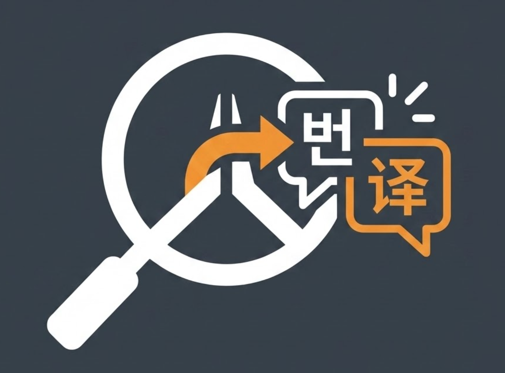

# OW-Light-Translator

<p align="center">
  
</p>

<p align="center">
  <strong>경량 · 실시간 · 안티치트 고려 · 오버워치 화면 번역 Overlay</strong>
</p>

**Language / 语言 / 言語 / 언어：** [中文](README.md) | [English](README.en.md) | [日本語](README.ja.md) | **한국어**

---

## 한국어

### 프로젝트 소개

**OW-Light-Translator**는 《오버워치》 플레이어를 위한 **외부 화면 번역 도구**입니다. 아시아 서버에서 흔한 한·일·영 혼합 채팅——`힐좀`, `C9`, `support diff`, `源氏1hp`——을 영역 지정 후 단축키 한 번으로 인식하고, **중국 본토 게이머들이 익숙한 표준 중문 게임 용어**로 번역해 투명 Overlay에 표시합니다. 게임 조작을 방해하지 않습니다.

추천 대상:

- 아시아 서버 경쟁전에서 빠른 소통 번역이 필요하지만 한/일/영 혼합 채팅을 읽기 어려운 플레이어
- 「외부 Overlay + 비동기 OCR/LLM」아키텍처를 배우고 싶은 Python 개발자

### 안티치트·보안 설계

본 도구는 게임 메모리 **읽기/쓰기 없음**, **DLL 인젝션 없음**, **키·마우스 입력 시뮬레이션 없음**. Windows 표준 데스크톱 캡처(`mss` / Desktop Duplication)만 사용하며, 외부 창에 번역 결과를 표시합니다(OBS·Discord Overlay와 유사한 방식).

> ⚠️ 서드파티 도구 사용 위험은 본인이 판단해야 합니다. Blizzard Entertainment와 무관하며, 안티치트 시스템에 의해 표시되지 않는다고 보장하지 않습니다——신중히 사용하세요.

### OCR 인식 안내

현재 OCR은 **기본 설정**을 기준으로 동작합니다. 《오버워치》 채팅의 4가지 의미 색상(적 / 아군 / 파티 / 시스템)별로 마스크 채널을 나눠 인식하며, 색상 범위는 `config.py`의 `COLOR_PALETTE`에 정의되어 있습니다.

<p align="center">
  
</p>

> 위 그림: 게임 내 채팅 글자색과 의미 태그 대응. Enemy(빨강), Friendly(파랑), Group(초록), Alert(주황).

### 핵심 기능

| 기능 | 설명 |
|------|------|
| 듀얼 UI | **편집 모드**: 드래그·리사이즈 가능；**잠금 모드**: 테두리 없음·투명·클릭 통과·항상 위 |
| 디스크 I/O 제로 | 스크린샷을 메모리에서 Base64로 변환, 임시 파일 없음 |
| 멀티 채널 OCR | 색상 마스크로 채널 분리, 배경 노이즈 감소 |
| 비동기 파이프라인 | UI / 핫키 논블로킹；캡처 → OCR → 번역을 백그라운드 `asyncio` worker에서 처리 |
| OW 슬랭 전문 | DeepSeek System Prompt 내장. C9, Diff, 영웅 약어, 한·일 콜아웃 커버 |

### 처리 흐름

<p align="center">
  
</p>

> 위 그림: 전체 데이터 흐름 — `mss` 영역 캡처(메모리 Base64) → `COLOR_PALETTE` 멀티 채널 색상 마스크 → 智谱 GLM-OCR → DeepSeek 번역 → CustomTkinter Overlay 의미 색상 렌더링.

### 프로젝트 구조

```
overwatch_translate_tool/
├── main.py            # 진입점 (ow_color_fluent.app.main 호출)
├── ow_color_fluent/   # UI / API / runtime 패키지
├── requirements-docker.txt  # Docker API 전용 의존성
├── api_client.py      # GLM-OCR / DeepSeek 비동기 HTTP 클라이언트
├── config.py          # DTO 및 환경 변수
├── prompts.py         # OW 슬랭 번역 System Prompt
├── local_api_keys.py  # 로컬 API Key (gitignore)
├── img/
│   ├── image.png      # 상세 시스템 흐름도
│   └── font_color.png # 채팅 색상 의미 참고 이미지
├── requirements.txt
├── README.md
├── README.en.md
├── README.ja.md
└── README.ko.md
```

### 개발자 가이드

기여 개발자를 위한 환경·기술 스택·협업 절차 안내입니다.

#### 환경 요구사항

| 항목 | 요구 | 비고 |
|------|------|------|
| OS | **Windows 10/11** | 주 타깃；`mss` 캡처·`keyboard` 단축키는 Windows에서 가장 안정적 |
| Python | **3.10+** (3.11 / 3.12 권장) | `dataclass(slots=True)` 등 최신 문법 사용 |
| 패키지 | `pip` + `venv` | 가상환경 사용 권장 |
| VCS | **Git** | Fork → 브랜치 → PR |
| IDE | **VS Code / Cursor** | Python + Pylance；Overlay 디버깅 시 듀얼 모니터 권장 |
| 선택 | 《오버워치》 클라이언트 | 실제 화면 OCR 튜닝 시 필요；API만 작업 시 불필요 |

#### 기술 스택

| 계층 | 라이브러리 / 서비스 | 버전 | 역할 |
|------|---------------------|------|------|
| UI | [CustomTkinter](https://github.com/TomSchimansky/CustomTkinter) | `>=5.2.2` | 프레임리스 투명 Overlay, 드래그, 색상 텍스트 |
| Windows API | [pywin32](https://github.com/mhammond/pywin32) | `>=306` | DPI 인식, 마우스 클릭 통과 |
| 캡처 | [mss](https://python-mss.readthedocs.io/) | `>=9.0.1` | 영역 스크린샷 (메모리 전용) |
| 이미지 | [OpenCV](https://opencv.org/) | `>=4.10` | 색상 마스크, 모폴로지, PNG 메모리 인코딩 |
| 수치 | [NumPy](https://numpy.org/) | `>=1.26` | 프레임·마스크 배열 연산 |
| 이미지 | [Pillow](https://python-pillow.org/) | `>=10.3` | 이미지 포맷 보조 |
| 네트워크 | [httpx](https://www.python-httpx.org/) | `>=0.27` | GLM-OCR / DeepSeek 비동기 HTTP |
| 동시성 | `asyncio` (표준) | — | UI와 OCR/번역 worker 분리 |
| 핫키 | [keyboard](https://github.com/boppreh/keyboard) | `>=0.13.5` | 전역 단축키 |
| 설정 | [python-dotenv](https://github.com/theskumar/python-dotenv) | `>=1.0` | `.env` URL·타임아웃 |
| OCR API | 智谱 **GLM-OCR** | — | 멀티 채널 OCR |
| 번역 API | **DeepSeek Chat** | — | OW 슬랭 → 중문 |

#### 빠른 시작

```bash
git clone https://github.com/<your-org>/overwatch_translate_tool.git
cd overwatch_translate_tool

python -m venv .venv
.venv\Scripts\Activate.ps1

pip install -U pip
pip install -r requirements.txt

python main.py    # main.py 완료 후
```

#### API Key 설정

루트 `local_api_keys.py` 편집 (gitignore):

```python
GLM_API_KEY = "智谱 GLM Key"
DEEPSEEK_API_KEY = "DeepSeek Key"
```

`.env` 대체 가능 (우선순위: `local_api_keys.py` > 환경 변수).

#### 모듈 역할

| 파일 | 책임 | 일반적인 변경 |
|------|------|---------------|
| `config.py` | DTO, `COLOR_PALETTE` | 색상 마스크, 타임아웃 |
| `prompts.py` | Prompt | 슬랭, 번역 톤 |
| `api_client.py` | 캡처·OCR·번역 | 동시성, 재시도, 파싱 |
| `ow_color_fluent/ui/overlay_window.py` | CustomTkinter UI | 다해상도, 클릭 통과, 렌더링 |
| `main.py` | 진입점 | 보통 변경 불필요 |
| `local_api_keys.py` | 로컬 키 | 커밋 금지 |

#### 기여 절차

Fork → `git checkout -b feat/xxx` → 구현·검증 → commit/push → Pull Request

**PR 포함 사항:** 변경 이유, 영향 모듈, 테스트 방법 (API만 / 게임 연동).

#### 로컬 디버깅

```python
import asyncio
from api_client import capture_region_to_base64, process_multi_channel_ocr, translate_ocr_results

async def smoke_test():
    capture = capture_region_to_base64({"left": 0, "top": 0, "width": 800, "height": 400})
    ocr = await process_multi_channel_ocr(capture)
    print(await translate_ocr_results(ocr))

asyncio.run(smoke_test())
```

| 증상 | 확인 |
|------|------|
| OCR 비어 있음 | `GLM_API_KEY`, `COLOR_PALETTE`, 캡처 영역 |
| 번역 비어 있음 | `DEEPSEEK_API_KEY`, 네트워크, `prompts.py` |
| 핫키 무반응 | 관리자 실행, 단축키 충돌 |
| import 오류 | venv 활성화, `pip install -r requirements.txt` |

### 개발 현황

| 모듈 | 상태 |
|------|------|
| `config.py` | ✅ 완료 |
| `prompts.py` | ✅ 완료 (업데이트 가능) |
| `api_client.py` | ✅ 완료 |
| `main.py` | 🚧 진행 중 |

### 기여·라이선스

Issue / PR 환영합니다. 특히 한국어·일본어에 능숙한 플레이어의 더 정확한 현지화 번역 사례 제공 및 PR을 기대합니다. Blizzard 이용약관을 준수하고, 치트·자동 조작 용도로 사용하지 마세요.
---

## License

MIT（予定 / TBD — 正式许可文件添加前请以仓库内 LICENSE 为准）
