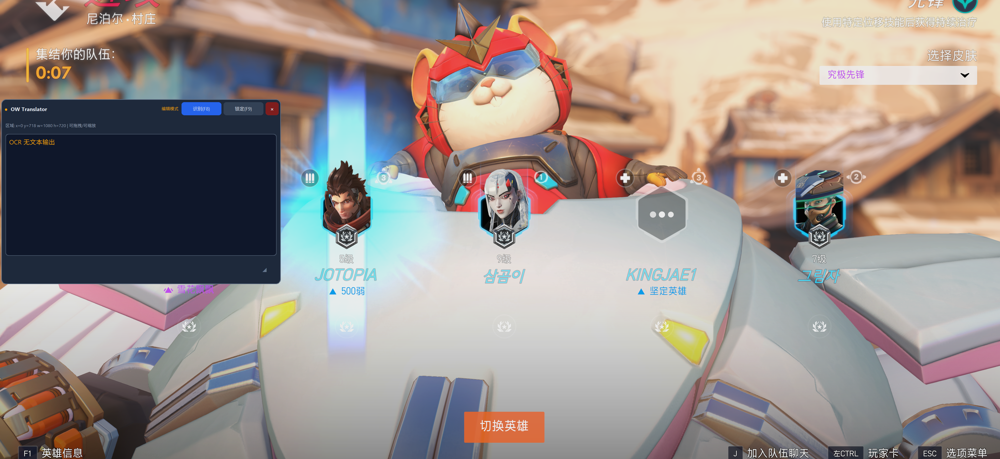
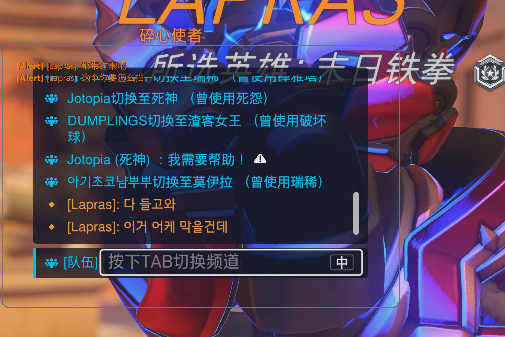
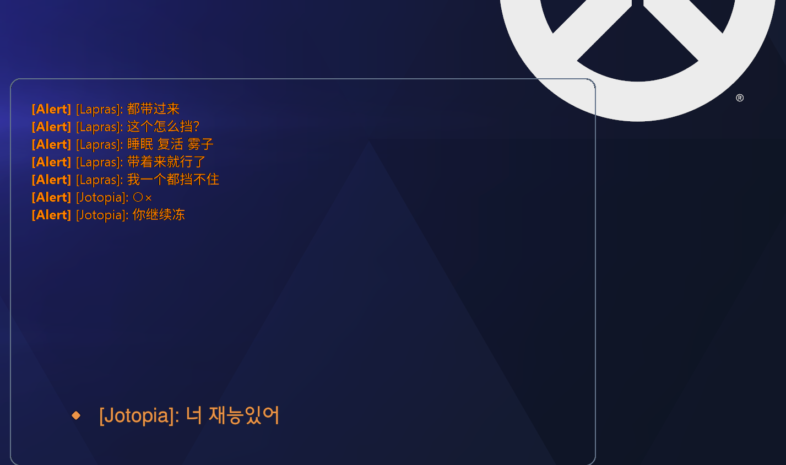
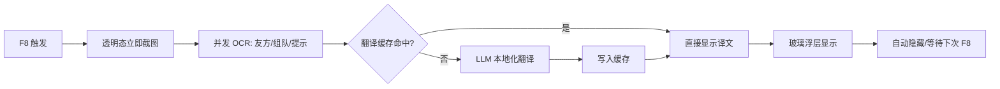

# OW-Light-Translator

<p align="center">
  
</p>

<p align="center">
  <strong>轻量级 · 实时 · 反作弊友好 · 守望先锋屏幕翻译 Overlay</strong>
</p>

**Language / 语言 / 言語 / 언어：** **中文** | [English](README.en.md) | [日本語](README.ja.md) | [한국어](README.ko.md)

---

## 中文

### 项目简介

**OW-Light-Translator** 是一款面向《守望先锋》玩家的**外部屏幕翻译工具**。你在亚服排到的韩文、日文、英文混排聊天——`힐좀`、`C9`、`support diff`、`源氏1hp`——框选区域后一键识别并翻成**国服玩家习惯的中文术语**，显示在透明 Overlay 上，不打断操作。

适合：

- 在亚服打竞技、快速交流但读不懂韩/日/英混排的玩家
- 想学习「外部 Overlay + 异步 OCR/LLM」架构的 Python 开发者

### 反作弊与安全设计

本工具**不读取、不写入游戏内存**，**不注入 DLL**，**不模拟键鼠输入**。仅使用 Windows 标准桌面截图（`mss` / Desktop Duplication）在外部窗口显示翻译结果，与 OBS、Discord Overlay 同类思路。

> ⚠️ 任何第三方工具的使用风险需自行评估。本项目与 Blizzard Entertainment 无关，也不保证不被反作弊系统标记——请谨慎使用。

### OCR 识别说明

目前 OCR 的识别以**默认设置**为主：按《守望先锋》聊天框四类语义颜色（敌方 / 友方 / 队伍 / 系统提示）进行多通道掩码识别，颜色范围见 `config.py` 中的 `COLOR_PALETTE`。

<p align="center">
  
</p>

> 上图：游戏内聊天文字颜色与语义标签对应关系。Enemy（红）、Friendly（蓝）、Group（绿）、Alert（橙）。

#### TODO（OCR 与 UI）

- [x] **多分辨率 Overlay 适配**：按屏幕高度比例自动计算窗口尺寸与位置（`H = screen_h / 6`，左下角定位），字体与控件随窗口缩放。
- [ ] **可配置聊天颜色**：当前默认使用固定 `COLOR_PALETTE`；需支持玩家自定义聊天颜色主题（例如通过配置文件切换/覆盖 RGB 范围）。

### 核心特性

| 特性 | 说明 |
|------|------|
| 三态 Overlay | **编辑模式**：对齐聊天框；**锁定模式**：全透明 + 鼠标穿透；**F8 译文**：Win11 毛玻璃浮层 |
| 多分辨率适配 | 按屏幕高度 `1/6` 自动缩放窗口与字体，1K / 2K / 4K 左下角比例一致 |
| 零磁盘 I/O | 截图在内存中直接转 Base64，不写临时文件 |
| 多通道 OCR | 按颜色掩码分通道识别，降低复杂背景干扰 |
| 异步流水线 | UI / 热键不阻塞；截图 → OCR → 翻译在后台 `asyncio` worker 中完成 |
| OW 俚语专家 | 内置 DeepSeek System Prompt，覆盖 C9、Diff、英雄缩写、韩日常用 callout |
| 应用图标 | `img/icon.png` 源图 → `img/icon.ico`，用于窗口、任务栏与 PyInstaller 打包 exe |

### Overlay 使用流程

| 步骤 | 操作 | 界面表现 |
|------|------|----------|
| 1 | 启动 `python main.py` | **编辑模式**：半透明面板，拖拽对齐 OW 聊天区域 |
| 2 | `F9` 锁定 | **全透明**，鼠标穿透，游戏中不可见 |
| 3 | `F8` 识别 | **毛玻璃浮层**显示译文（Win11 DWM Acrylic / Mica） |
| 4 | 约 12 秒后 | 自动隐藏（`GLASS_AUTO_HIDE_MS` 可配置） |
| 5 | 再按 `F9` | 回到编辑模式调整位置 |

> **编辑模式**下为实心/半透明面板，**不会**显示毛玻璃——这是正常现象，用于对齐选区。

### 实际使用截图与反馈

以下截图来自当前版本的真实游戏使用画面，用于记录 Overlay 对齐、聊天识别与译文展示效果。

<p align="center">
  
</p>

> 编辑模式下可以拖拽和缩放窗口，对齐左下角聊天区域；当画面中没有可识别聊天内容时，会显示 OCR 无文本输出。

<p align="center">
  
</p>

> 实战聊天场景中，OCR 与翻译流水线已经能更快地返回结果， F8 快速查看队伍与系统提示信息。

<p align="center">
  
</p>

> 当前本地化效果仍在继续打磨：部分韩文口语、玩家昵称、英雄简称和局内语气还需要更贴近国服玩家表达。最近一版在响应速度上已经有明显提升，后续会继续寻找其他优化翻译速度的方法，例如更细的缓存策略、减少无效 OCR 通道、优化请求并发与超时策略。

### 性能与稳定性调优

实时查看翻译时，优先减少 OCR 请求数与窗口状态切换耗时。可在 `.env` 中覆盖：



```env
# 默认只识别友方/组队/系统提示，跳过通常没有聊天文字的 Enemy 红色通道
OCR_CHANNELS=Friendly,Group,Alert

# OCR 并发数；网络和 API 限流允许时可提高，遇到 429/超时可降到 1 或 2
OCR_MAX_CONCURRENT=3

# 编辑模式截图前隐藏窗口的等待时间；锁定透明模式不走这个等待
CAPTURE_HIDE_DELAY_MS=35

# API 超时；实时翻译建议保持较短，避免一次慢请求拖住热键
HTTP_TIMEOUT_SEC=18
```

F8 连按时，程序会记录一次“待刷新”请求，当前识别结束后自动抓取最新画面；重复文字会命中内存翻译缓存，减少同一段聊天反复请求翻译模型。


### 项目结构

```
overwatch_translate_tool/
├── main.py            # 启动入口（调用 ow_color_fluent.app.main）
├── ow_color_fluent/   # 模块化主包
│   ├── app.py         # CustomTkinter 应用入口与 mainloop
│   ├── core/
│   │   ├── config.py  # DTO、颜色语义、环境变量
│   │   └── prompts.py # OCR/翻译 Prompt 策略
│   ├── services/
│   │   └── api_client.py   # 多通道 OCR + 翻译客户端
│   ├── ui/
│   │   └── overlay_window.py # 悬浮窗 GUI 与交互逻辑
│   └── runtime/
│       └── async_runtime.py  # asyncio 后台循环线程
├── api_client.py      # 兼容导出层（转发到 package）
├── config.py          # 兼容导出层（转发到 package）
├── prompts.py         # 兼容导出层（转发到 package）
├── local_api_keys.py  # 本地 API Key（已 gitignore）
├── img/
│   ├── image.png      # 详细系统流程图
│   ├── font_color.png # 聊天颜色语义参考图
│   ├── icon.png       # 应用图标源文件
│   ├── icon.ico       # Windows 窗口 / exe 图标
│   └── screenshots/   # 实际使用截图
├── scripts/               # venv 安装脚本（提交到 Git，见 scripts/README.md）
│   ├── setup_venv.ps1
│   ├── setup_venv.bat
│   ├── setup_venv.sh
│   └── activate_venv.ps1
├── venv/                  # 本地虚拟环境（.gitignore，勿提交）
├── requirements.txt         # Windows 完整依赖（含 UI）
├── requirements-docker.txt  # Docker API 开发依赖（无 UI）
├── Dockerfile
├── docker-compose.yml
├── DOCKER_README.md
├── README.md
├── README.en.md
├── README.ja.md
└── README.ko.md
```

### 开发者指南

面向希望参与本项目的开发者，本节汇总环境、技术栈与协作流程。

#### 环境要求

| 类别 | 要求 | 说明 |
|------|------|------|
| 操作系统 | **Windows 10/11** | 主运行环境；`mss` 桌面截图、`keyboard` 全局热键在 Windows 上最稳定 |
| Python | **3.10+**（推荐 3.11 / 3.12） | 项目使用 `dataclass(slots=True)` 等现代语法 |
| 包管理 | `pip` + `venv` | 建议使用虚拟环境隔离依赖 |
| 版本控制 | **Git** | Fork → 分支 → PR 协作 |
| IDE | **VS Code / Cursor** | 推荐安装 Python、Pylance；调试 Overlay 时建议双屏 |
| 可选 | 《守望先锋》客户端 | 联调截图/OCR 时需要；纯 API 层开发可不启动游戏 |

#### 技术栈

| 层级 | 库 / 服务 | 版本约束 | 在本项目中的作用 |
|------|-----------|----------|------------------|
| UI | [CustomTkinter](https://github.com/TomSchimansky/CustomTkinter) | `>=5.2.2` | 无边框透明悬浮窗、拖拽缩放、彩色文本渲染 |
| Windows API | [pywin32](https://github.com/mhammond/pywin32) | `>=306` | DPI 感知、鼠标穿透（`WS_EX_TRANSPARENT`） |
| 截图 | [mss](https://python-mss.readthedocs.io/) | `>=9.0.1` | 区域桌面截图，内存直出，不写临时文件 |
| 图像处理 | [OpenCV](https://opencv.org/) | `>=4.10` | `inRange` 颜色掩码、形态学降噪、PNG 内存编码 |
| 数值计算 | [NumPy](https://numpy.org/) | `>=1.26` | 截图帧与掩码数组运算 |
| 网络 | [httpx](https://www.python-httpx.org/) | `>=0.27` | GLM-OCR、DeepSeek 异步 HTTP 请求 |
| 并发 | `asyncio`（标准库） | — | UI 主线程与 OCR/翻译 worker 解耦 |
| 热键 | [keyboard](https://github.com/boppreh/keyboard) | `>=0.13.5` | 全局快捷键（截图、锁定切换等） |
| 配置 | [python-dotenv](https://github.com/theskumar/python-dotenv) | `>=1.0` | 读取 `.env` 中的 URL、超时等可选配置 |
| OCR API | 智谱 **GLM-OCR** (`glm-ocr`) | — | 多通道掩码图文字识别 |
| 翻译 API | **DeepSeek Chat** (`deepseek-chat`) | — | OW 亚服俚语 → 中文竞技术语 |

#### 快速开始

```bash
# 1. 克隆仓库
git clone https://github.com/Donutcheese/overwatch_translate_tool.git
cd overwatch_translate_tool

# 2. 创建并激活虚拟环境（Windows，推荐）
#    方式 A — 一键脚本（推荐）
.\scripts\setup_venv.bat
# 或 PowerShell:
#   .\scripts\setup_venv.ps1
#
#    方式 B — 手动
# python -m venv venv
# .\venv\Scripts\Activate.ps1
#
# 3. 若用手动方式，再安装依赖:
# pip install -U pip
# pip install -r requirements.txt
#
# 4. 配置 API Key（见下方「密钥配置」）
# 5. 启动主程序
python main.py
```

首次克隆后若缺少 `img/icon.ico`，可运行：

```powershell
pip install Pillow
python scripts/generate_icon.py
```

打包 exe（含 exe 文件图标）：

```powershell
.\scripts\build.bat
# 输出: dist\OW-Color-Fluent-Translator.exe
```

> **说明**：`venv/` 目录已在 `.gitignore` 中，每位开发者本地自行创建，**不要**将虚拟环境提交到 Git。仓库仅提供 `scripts/setup_venv.ps1` / `.bat` / `.sh` 安装脚本。

默认热键（可通过环境变量 `HOTKEY_CAPTURE` / `HOTKEY_TOGGLE_LOCK` 覆盖）：

| 热键 | 功能 |
|------|------|
| `F8` | 截取 Overlay 区域并触发 OCR + 翻译 |
| `F9` | 切换编辑模式 / 锁定穿透模式 |

> `keyboard` 全局热键在 Windows 上建议**以管理员身份**运行 PowerShell 后启动。

#### 密钥配置

在项目根目录编辑 `local_api_keys.py`（已加入 `.gitignore`，不会提交到 Git）：

```python
GLM_API_KEY = "你的智谱 GLM Key"
DEEPSEEK_API_KEY = "你的 DeepSeek Key"
```

也可选用 `.env` 作为备选（优先级：`local_api_keys.py` > 环境变量）：

```env
GLM_API_KEY=...
DEEPSEEK_API_KEY=...
GLM_OCR_URL=https://open.bigmodel.cn/api/paas/v4/chat/completions
DEEPSEEK_URL=https://api.deepseek.com/chat/completions
HTTP_TIMEOUT_SEC=30
```

#### 模块职责（改哪里）

| 文件 | 职责 | 典型改动 |
|------|------|----------|
| `ow_color_fluent/core/config.py` | DTO、`COLOR_PALETTE`、API 端点 | 调整聊天颜色掩码范围、超时时间 |
| `ow_color_fluent/core/prompts.py` | OCR/翻译 Prompt、消息体构造 | 补充 OW 俚语、优化翻译风格 |
| `ow_color_fluent/services/api_client.py` | 截图、颜色掩码、OCR/翻译 HTTP | 并发策略、错误重试、响应解析 |
| `ow_color_fluent/ui/overlay_window.py` | CustomTkinter 悬浮窗 GUI 与交互 | 多分辨率适配、拖拽缩放、锁定穿透、彩色文本 |
| `ow_color_fluent/runtime/async_runtime.py` | 后台异步循环 | asyncio 与 UI 线程解耦 |
| `ow_color_fluent/app.py` | 应用装配 | 启动流程、平台提示 |
| `main.py` | 启动入口 | CLI 调起 GUI（通常无需改动） |
| `local_api_keys.py` | 本地密钥 | 仅本机填写，勿提交 |
| `img/icon.png` | 应用图标源文件（PNG） | 更新品牌图标后运行 `scripts/generate_icon.py` |
| `img/icon.ico` | Windows 窗口 / exe 图标 | 由 `icon.png` 自动生成，也可直接替换 |
| `img/font_color.png` | 颜色语义参考图 | 更新 OW 聊天配色对照 |

#### Overlay 尺寸与分辨率（已实现）

`ow_color_fluent/ui/overlay_window.py` 中 `_update_geometry_by_ratio()` 规则：

- 窗口高度 `H = max(180, screen_height / 6)`，宽度 `W = H × 1.5`
- 默认位置：屏幕左下角 `(x=20, y=screen_height - H - 20)`
- 通过 `GetSystemMetrics` + DPI Awareness 获取真实分辨率
- 字体与按钮尺寸随窗口高度等比缩放

#### 开发说明（针对上述 TODO）

**聊天颜色可配置（非默认主题支持）**

- 主要改动文件：`ow_color_fluent/core/config.py`、`local_api_keys.py`（或新增专用颜色配置文件）、`ow_color_fluent/services/api_client.py`
- 建议实现方式：
  - 方案 A（推荐）：新增 `color_palette.json`，启动时加载并覆盖默认 `COLOR_PALETTE`
  - 方案 B：使用环境变量（如 `OW_COLOR_FRIENDLY_MIN=...`）覆盖默认值
  - 保留默认兜底：当自定义配置缺失/格式错误时回退到内置默认值
- 验收标准：
  - 用户修改颜色配置后无需改代码即可生效
  - 颜色范围配置错误时程序不崩溃，并提示回退默认值
  - 在自定义颜色主题下，OCR 命中率不低于默认主题基线

#### 参与开发流程

```
Fork 仓库
   │
   ▼
git checkout -b feat/your-feature    ← 从 main 拉功能分支
   │
   ▼
修改代码 + 本地验证                  ← 见下方「本地调试建议」
   │
   ▼
git commit / git push
   │
   ▼
发起 Pull Request                    ← 说明改动模块与测试方式
```

**PR 建议包含：**

- 改动动机（Bug / 功能 / Prompt 优化）
- 影响模块（如 `api_client.py`、`prompts.py`）
- 本地验证步骤（是否需游戏窗口、是否仅测 API）

#### 本地调试建议

**不启动游戏（API 层）：** 可在 Python REPL 或临时脚本中调用 `api_client`：

```python
import asyncio
from api_client import capture_region_to_base64, process_multi_channel_ocr, translate_ocr_results

async def smoke_test():
    capture = capture_region_to_base64({"left": 0, "top": 0, "width": 800, "height": 400})
    ocr = await process_multi_channel_ocr(capture)
    trans = await translate_ocr_results(ocr)
    print(trans)

asyncio.run(smoke_test())
```

**联调 Overlay（需 Windows + 游戏）：** 运行 `python main.py`，框选聊天区域，用热键触发截图 → OCR → 翻译链路。

**常见排查：**

| 现象 | 检查项 |
|------|--------|
| OCR 无输出 | `GLM_API_KEY`、掩码颜色范围（`COLOR_PALETTE`）、截图区域是否覆盖聊天框 |
| 翻译为空 | `DEEPSEEK_API_KEY`、网络代理、`prompts.py` 输出格式 |
| 热键无效 | Windows 是否以管理员运行（`keyboard` 偶需）、快捷键冲突 |
| 依赖导入失败 | 虚拟环境是否激活、`pip install -r requirements.txt` 是否成功 |
| Overlay 无法穿透 | 是否在 Windows 运行、`pywin32` 是否安装、F9 是否已切换锁定模式 |
| Docker 内无 GUI | 容器仅支持 API 测试，完整 Overlay 需在 Windows 宿主机运行（见 `DOCKER_README.md`） |

### 开发状态

| 模块 | 状态 |
|------|------|
| `config.py` | ✅ 已完成 |
| `prompts.py` | ✅ 已完成（可更新） |
| `api_client.py` | ✅ 已完成 |
| `main.py` / `ow_color_fluent/app.py` | ✅ 已完成（CustomTkinter） |
| `ow_color_fluent/ui/overlay_window.py` | ✅ 已完成（多分辨率 + 穿透） |

### 贡献与许可

欢迎 Issue / PR，特别是懂韩语日语的玩家欢迎提供更精准的本地化翻译案例。请遵守 Blizzard 用户协议，勿将本项目用于作弊或自动化操作。
---

## License

MIT（予定 / TBD — 正式许可文件添加前请以仓库内 LICENSE 为准）
